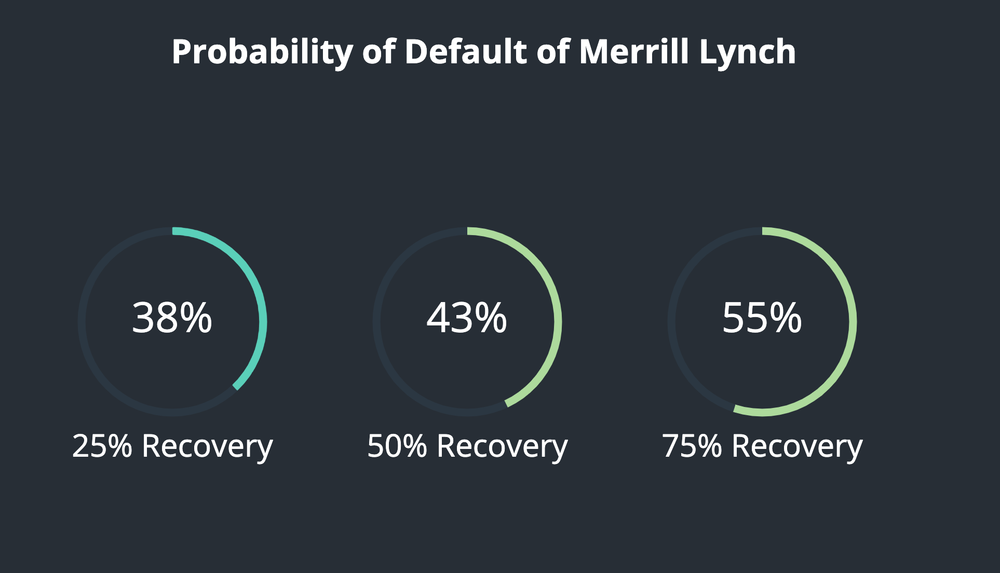

# Credit Default Swap Search Engine

## Introduction

Credit Default Swap Search Engine is an efficient search engine based on RESTful APIs to allow you to search and navigate historical mentions of credit default swaps all the way from 2004 - 2017. One can simply search for any specific credit default swap that they are looking for by simply entering the name of the *counterparty* or the *reference entity*.

## Features

The search engine has quite a few other resources which have been described in detail below:

### Search Engine

Upon extracting information from both structured and unstructured formats of Credit Default Swap reportings, we developed a search engine to enable future research studies to further take advantage of the consolidated data that has been aggregated through rule-based as well as NLP techniques.
 
 
This web application was built on Flask with the entire dataset of 16,813 rows into an array of JSON objects. JSON objects are the defacto standard for query based searching and also allow swift query and return time. Furthermore, this web application also serves as a way for researchers and financial analysts to upload reports that they want the Credit Default Swap information extracted from. The application itself is capable of extracting both structured as well as unstructured reporting of CDS as the model is running at the backend and is served as a RESTful framework.

### Named Entity Recognition

This part of the web application wants to show the trained Conditional Random Field model in action and gives an interactive way to do so. Once has to simply, enter the unstructured credit default swap sentence that he wants to be extracted and the API running in the backend will highlight the entities. A snapshot of the UI has been given below:

*Insert screenshot here*

### Report Processing

Report Processing enables analysts and researches to extract all the Credit Default Swap mentions any report by simply uploading the report they wish to be extracted(in .NET format) and shows all the CDS mentions in a structured format which could be easily downloaded for various studies and analysis.

### Probability of Default

Predicting the financial health of a company is something that financial analysts have longed for a very long time. In specific to the CDS market, this sort of analysis has a lot of relevance in the practical real world where in financial crisis could be evaded if such a framework devised in this research paper could be implemented and the data so extracted could be studied.  
 
To help serve as an example for future research and analysis, we have developed a novel method using one of a kind Credit Default Swap dataeet that we have developed. In order to predict the probability of default of Credit Default Swap, there are some key factors which play a role. These include, the recovery rate R and credit spread S. The dataset that we have put together allows us to extract the credit spread S for all the credit default swaps reported from 2004-2017 and hence allows us to compute the default probability of the firms that the user wants to search for by simply typing their name. What simplifies the entire process is the RESTful API which is running in the backend computing the default probabilities for all the three possible recovery rates and allowing the user to understand the likelihood of a specific financial institution defaulting on their credit default swap portfolio.  
 
Applications like this show how useful a Credit Default Swap dataset would be to trade in the CDS market and also shows the power of computation by using existing quantitative finance formula.
 
 

 
 

## Installation

## Requirements

<ul>
    <li>Python 3.7.3 64-bit</li>
    <li>Flask==1.0.2</li>
    <li>Jinja2==2.10</li>
    <li>json2html==1.2.1</li>
    <li>pandas==0.24.2</li>
</ul>

_More updates will follow with time_
